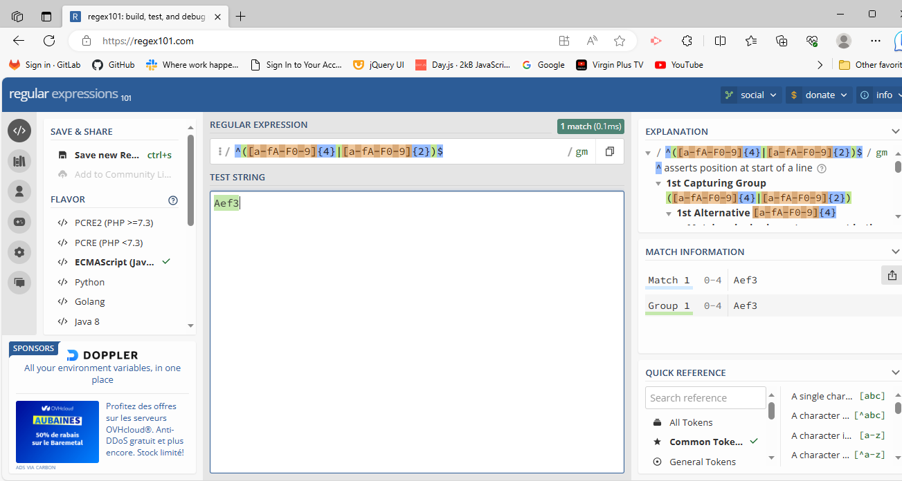

# Matching an Hexadecimal Regex by Hung Quoc Dang

## Summary

This tutorial shows the code snippet will filter out a validated Hexadecimal string of 2 and 4 digits, the strings entered by users can have any alphanumeric and any special characters:

^([a-fA-F0-9]{4}|[a-fA-F0-9]{2})$

The testing of this snippet can be done with https://regex101.com/ ; using flavor ECMASript(javaS…

A valid Hexadecimal digit must be one of these: 0, 1, 2, 3, 4, 5, 6, 7, 8, 9, A, B, C, D, E, F and the letters can be minuscule or majuscule.

This Regex, ^([a-fA-F0-9]{4}|[a-fA-F0-9]{2})$, can be useful for digital hardware design where a user enters a set of characters that need to be a valid Hexadecimal of 2 or 4 digits then to use an Hexadecimal to binary converter to get binary values that need to be put into an eight or sixteen bits register.  One Hexadecimal digit has 4 binary bits,  to affect eight-bits or sixteen-bits register will need 2 or 4 Hexadecimal digits.

DEMO on how to use it: https://drive.google.com/file/d/1Jyt5B4sVU3F90Vg2PLQcFxxTufhn3CtV/view

## Table of Contents

- [Anchors](#anchors)
- [Quantifiers](#quantifiers)
- [Grouping Constructs](#grouping-constructs)
- [Bracket Expressions](#bracket-expressions)
- [The OR Operator](#the-or-operator)

## Regex Components

Matching a Hex Value: ^([a-fA-F0-9]{4}|[a-fA-F0-9]{2})$

### Anchors

The anchors are used in defining the Regex snippets, the ^ and $ are to be put at the beginning and the end of the snippet.

This ^ asserts that the pattern must match the start of the string. This $ asserts that the pattern must match the end of the string.

### Quantifiers

The quantifiers are used by { } where element inside the curly parenthesis is an integer value indicating the desired number of digits forming a valid Hexadecimal string.  Here {4} and {2} in the snippet, used with Boolean OR logic, will set a match when two or four valid Hexadecimal digits are enter

### Grouping Constructs

Grouping-constructs or subexpression are ( ) inside the code snippets.  Where the pattern of characters inside the ( ) is set for exactly matching with a presented character string.  Where the corresponding snippet has one ( ).

### Bracket Expressions

Bracket Expressions uses [  ], elements inside the  [  ]  specify how the target string needs to be matched  based on any order indicating inside the [  ].  Here in the snippet, [a-fA-F0-9] set a matching condition for any letter from a to f or A to F in any order, and with any number from 0 to 9 in any order.

### The OR Operator

Here the Boolean OR logic uses | in the snippet.  So, in this snippet, ^([a-fA-F0-9]{4}|[a-fA-F0-9]{2})$,  the | is to filter out either 4 or 2 consecutive characters of validated Hexadecimal string.

## Author

Hung Quoc Dang has created a code snippet Regex or regular expression to determine a valid sequence of Hexadecimal digits. 

This Regex, ^([a-fA-F0-9]{4}|[a-fA-F0-9]{2})$, can be useful for digital hardware design where a user enters a set of characters that need to be a valid Hexadecimal of 2 or 4 digits then to use an Hexadecimal to binary converter to get corresponding binary values that need to be put into an eight or sixteen bits register.  One Hexadecimal digit has 4 binary bits,  to affect eight-bits or sixteen-bits register will need 2 or 4 Hexadecimal digits.  

Deployed link :  https://hungquocdang.github.io/Matching-Hex-Regex-Aug30/

GitHub Profile: https://github.com/HungQuocDang 

DEMO on how to use it:  https://drive.google.com/file/d/1Jyt5B4sVU3F90Vg2PLQcFxxTufhn3CtV/view

GitHub Gist: https://gist.github.com/HungQuocDang/45a182cac3bf92b2b4501193c52aacda 

